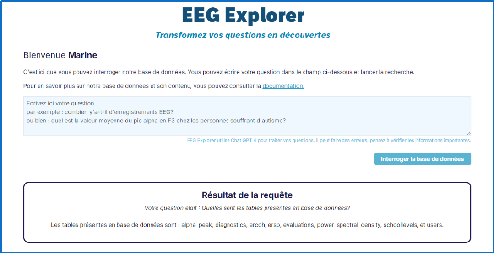
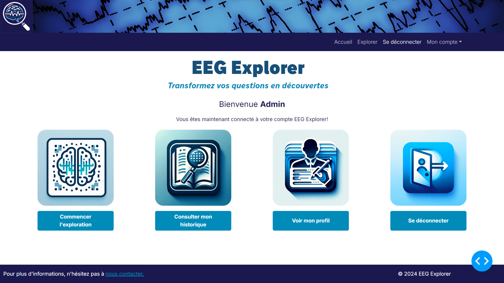
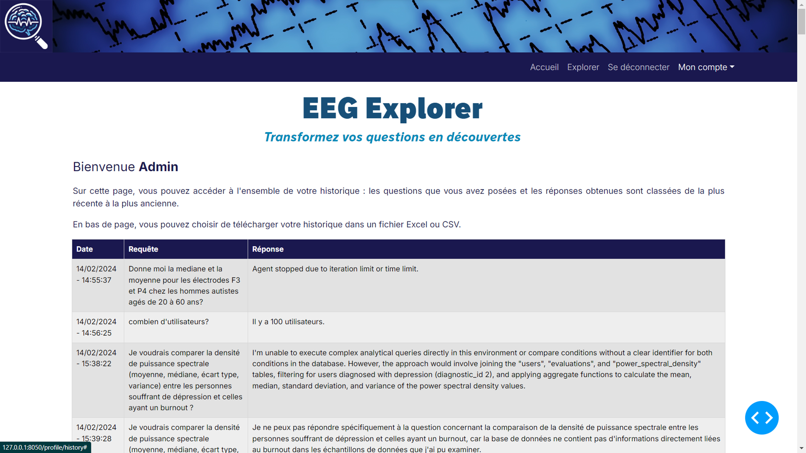

# EEG Explorer

**Natural-language exploration of synthetic EEG data through SQL generation.**

> **Status: Historical prototype — developed in 2024 as part of a professional certification project.**
>
> EEG Explorer was built to explore how non-technical users could query structured EEG-related data using natural language. The application uses a synthetic PostgreSQL dataset and was never deployed to production.

## Overview

EEG Explorer provides a conversational interface for exploring EEG-related data without requiring users to write SQL queries directly.

A user enters a question in natural language. The application uses a large language model to translate the question into SQL, executes the query against a PostgreSQL demonstration database containing synthetic EEG-related data, and returns the result through the application interface.

The project was developed in 2024 during my Data Scientist apprenticeship as part of my Application Developer professional certification.

## Demo

EEG Explorer was developed as a functional prototype with user authentication,
natural-language data exploration, query history and account management.

### Natural-language data exploration



The core workflow allows users to ask questions in natural language and receive
results generated from the synthetic EEG PostgreSQL database.

### Application dashboard



Authenticated users can access data exploration, their query history and
account management features.

### Query history



Questions and responses are stored in the user's history and can be exported
to CSV or Excel.

### Original 2024 Video Demo

A full video demonstration of the original prototype is also available:

**[Watch the original EEG Explorer demo](https://youtu.be/U6i4nTKpenc)**

> The video shows EEG Explorer as it existed during its original development
> in 2024. The current public repository has since been cleaned of
> company-specific references.

## How It Works

The main query workflow is:

1. The user enters a question in natural language.
2. The application sends the question to the LLM-based query agent.
3. The agent generates a SQL query.
4. The query is executed against the synthetic EEG PostgreSQL database.
5. The query result is processed by the application.
6. A response is returned to the user through the Dash interface.

## Architecture

EEG Explorer follows a multi-layer application structure separating the user interface, application logic and data access.

The main components are:

- **Dash** — web user interface
- **Flask** — backend and REST API
- **PostgreSQL** — application database and synthetic EEG demonstration database
- **LangChain** — orchestration of the natural-language-to-SQL workflow
- **OpenAI GPT-4 Turbo** — language model used by the original 2024 prototype
- **SQLAlchemy** — database access for application data

The application uses two distinct PostgreSQL databases:

- an application database used for application features such as user accounts;
- a synthetic EEG database queried through the natural-language interface.

## Main Features

- Natural-language questions over structured EEG-related data
- LLM-assisted SQL generation
- PostgreSQL query execution
- Dash-based interactive interface
- User authentication and account management
- Query history
- REST API
- Basic input safety checks before query processing

## Data

EEG Explorer uses a **synthetic demonstration database** designed to represent EEG-related data.

No production database or real clinical dataset is included in this repository.

The project was designed as a technical prototype for experimenting with natural-language access to structured data.

## Technology Stack

**Language**

- Python

**Application**

- Dash
- Flask
- Flask REST API

**Data**

- PostgreSQL
- SQLAlchemy
- SQL

**LLM**

- LangChain
- OpenAI GPT-4 Turbo

**Development**

- Poetry
- Git / GitHub

## Local Development

### Prerequisites

- Python
- Poetry
- PostgreSQL

### Environment configuration

Copy the example environment file:

```bash
cp .env.example .env
```

Then configure the required local environment variables in `.env`.

The application expects separate connections for the application database and the synthetic EEG database.

### Install dependencies

```bash
poetry install
```

### Run the application

The repository contains the original launch script:

```bash
./app.sh
```

> This repository represents the original 2024 prototype. Dependencies and external LLM APIs may have evolved since its development, so additional adjustments may be required to run it with current versions.

## Project Context

EEG Explorer was developed in 2024 as part of my Data Scientist apprenticeship and Application Developer certification.

The objective was to experiment with making structured data accessible to users who do not necessarily know SQL, by combining a web application, relational databases and a large language model.

The project remained a prototype and was not deployed to production.

## Certification Documentation

EEG Explorer was presented in 2024 as part of my Application Developer
professional certification.

The original certification materials are available here:

- [Project presentation](docs/certification/eeg-explorer-presentation.pdf)
- [Project summary](docs/certification/eeg-explorer-project-summary.pdf)
- [Full project report](docs/certification/eeg-explorer-project-report.pdf)

> These documents are preserved as historical certification materials and
> reflect the project and its professional context as presented in 2024.

## From EEG Explorer to AskMyData

EEG Explorer was my first implementation of a natural-language-to-SQL application.

The concepts explored in this prototype later inspired **AskMyData**, a broader project focused on controlled natural-language exploration of PostgreSQL data, with a more structured architecture, SQL validation, read-only safeguards, testing and containerized development.

[View AskMyData on GitHub](https://github.com/MarinePernici/AskMyData)

## Author

Marine Pernici

